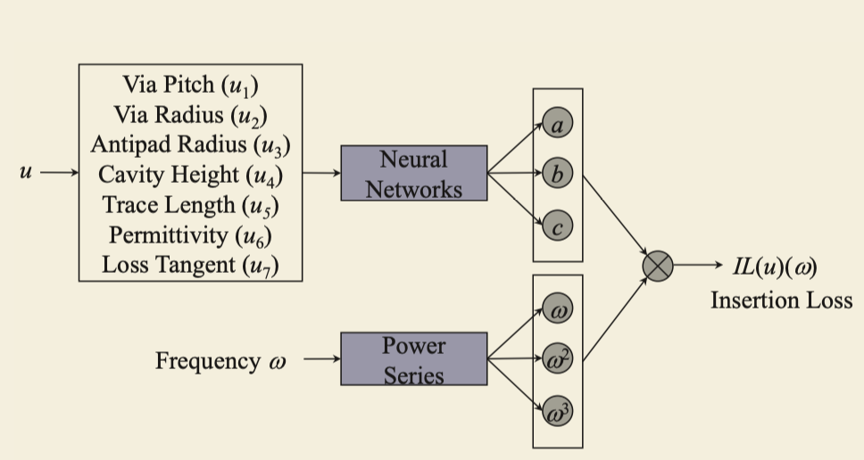

# Physics-Enforced Modeling for IL of Transmission Lines by DNN

Review of __*Physics-Enforced Modeling for Insertion Loss of Transmission Lines by Deep Neural Networks, Liang Chen & Lesley Tan*__.

## Paper summary
- Problem: Standard NNs' prediction of IL values can violate physics constraints.
- Proposed solution 1: Introduces a physics-enforced loss function to replace the one of standard neural networks.
- Proposed solution 2: Replace IL formula with a polymonial approximation form that complys physics nature.

## Database: SI/PI PCB Database
- 11-cavity PCB
- Two 10×10 via arrays
- 6 striplines (12 ports)
- 7030 samples

## Inputs: $u = (u_1, u_2, \dots, u_7, \omega)$  
- $u_1$ - Via pitch
- $u_2$ - Via radius
- $u_3$ - Antipad radius
- $u_4$ - Cavity height
- $u_5$ - Trace length
- $u_6$ - Permittivity
- $u_7$ - Loss tangent
- $\omega$ - Frequency $\omega$

## Output: Insertion Loss - $IL(u, \omega)$

## Baseline: Standard NN
Loss function: MSE (Mean Square Error)
$$
Loss_m = \frac{1}{N} \sum_{i=1}^{N} (IL_{i}^{pred} - IL_{i}^{true})^2
$$
Problem: Some prediction $IL < 0$, which violates physics constraints.

## Solution 1: Physics-Ennforced DNN (PDNN)
Replace loss function MSE
$$Loss_m = \frac{1}{N} \sum_{i=1}^{N} (IL_{i}^{pred} - IL_{i}^{true})^2$$
with enforced physics rule:
$$Loss =  Loss_m + \lambda \cdot Loss_p$$
where:
$$Loss_p = max(0, -IL^{pred})$$
So that:
- if $IL^{pred} \ge 0 \rightarrow$ no penalty
- if $IL^{pred} \lt 0 \rightarrow$ penalty increases  
This is a simplified form of __Physics-Informed Neural Network (PINN)__

## Solution 2: Polynomial-Based DeepONet (PdeepONet, polynomial regression surrogate)
Instead of predicting IL directly, the IL is extended to polynomial:
$$
IL(\omega) = a \omega + b \omega^2 + c \omega^3
$$
where: $a, b, c$ depend on design parameters $u$.

Neural network model predicts: $(a, b, c) = NN(u)$  
Final prediction:

Summary of solution 2:
- Collect sampled data $(\omega_{k}, IL_k)$
- Perform polynomial fitting (least squares)
- Treat $a, b, c$ as regresion coefficients.

## Performance
| Method    | Train MSE | Test MSE | Training Time | Inference Time  | Physics Safe |
| --------- | --------- | -------- | ------------- | --------------- | ------------ |
| NN        | 0.0150    | 0.0145   | 603 s         | Fast            | No           |
| PDNN      | 0.0150    | 0.0145   | 1851 s        | Fast            | Yes          |
| PDeepONet | 0.0151    | 0.0146   | 425 s         | Slightly slower | Yes          |

## Value for my project
- S-parameter modeling
- Passivity enforcement
- Deep learning for EM systems
- Operator learning (DeepONet)
- Structured surrogate modeling

It provides a foundation for:
- Passivity-preserving S-parameter modeling
- Rational-function ML surrogates
- Physics-aware surrogate modeling for high-speed channels
